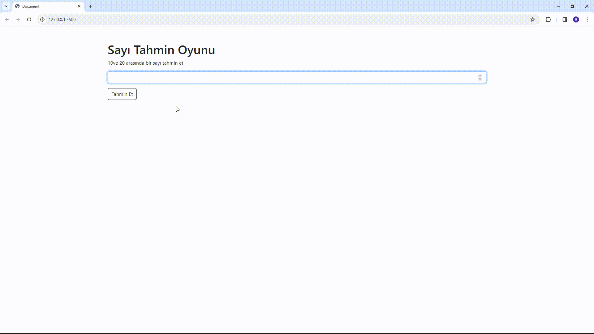

<h1>Number-Guesser-Project</h1>

Nasıl Çalışır?

-Oyuncu, belirlenen sayı aralığında (min ve max değerleri arasında) rastgele bir sayıyı tahmin etmeye çalışır.

-Tahmin edilen sayı, doğru sayıyla karşılaştırılır.

-Eğer doğru tahmin edilirse, oyuncu kazanır. Aksi takdirde, oyuncuya kalan tahmin hakkı bildirilir.

-Oyun, oyuncunun doğru tahminde bulunması veya tahmin hakkının bitmesi durumunda sona erer.

